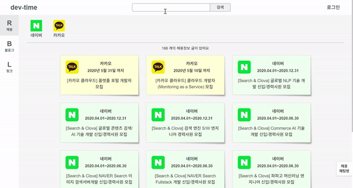
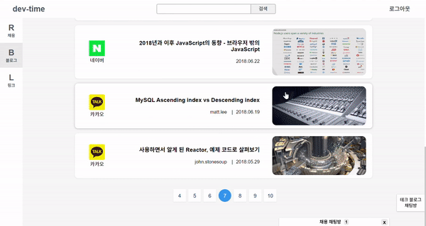
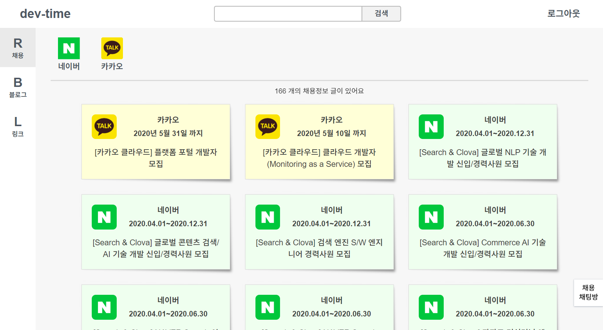
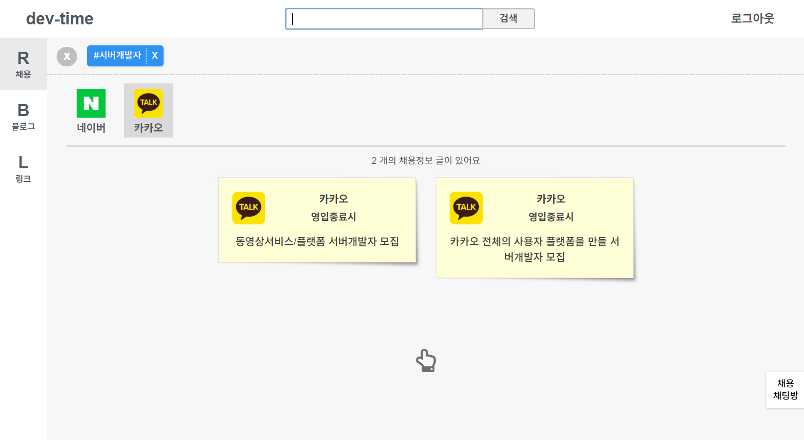
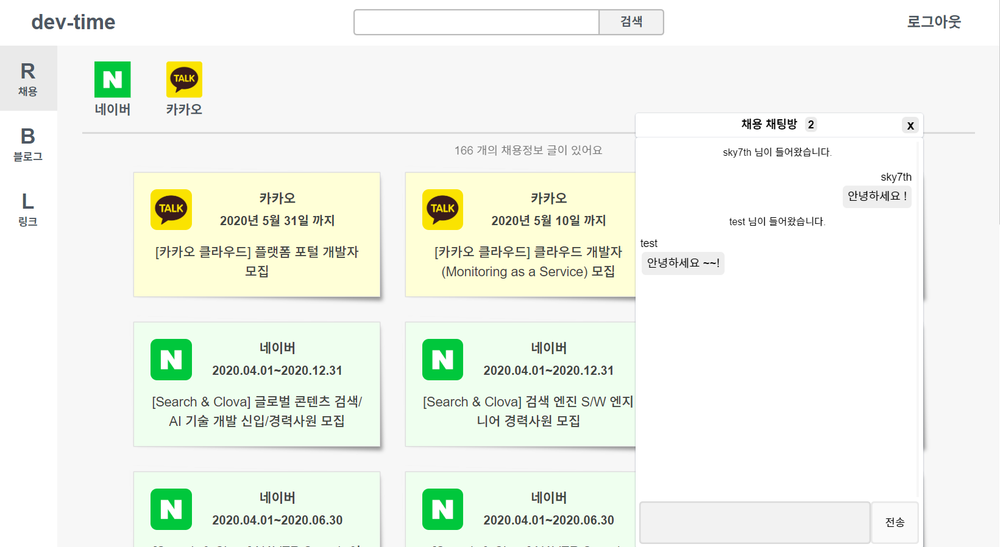
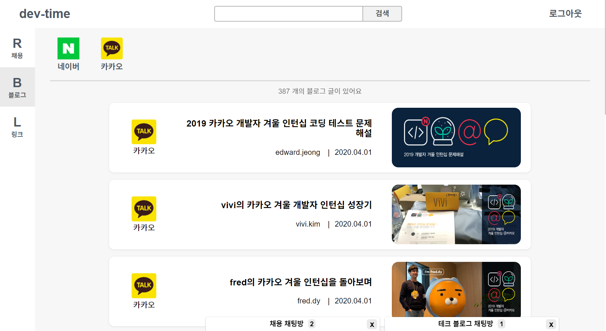
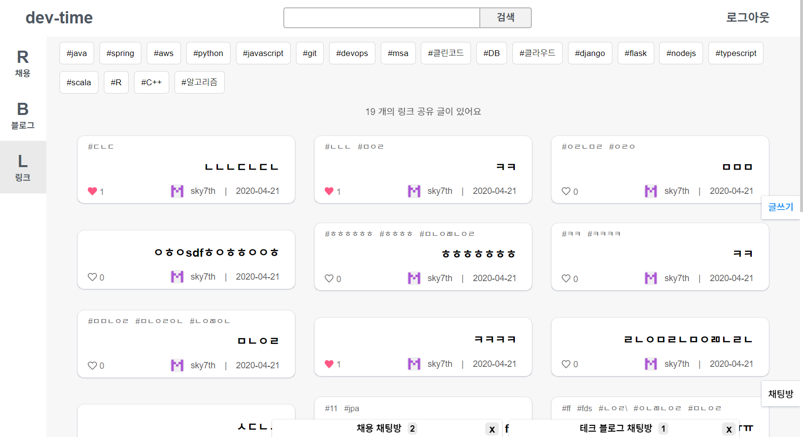
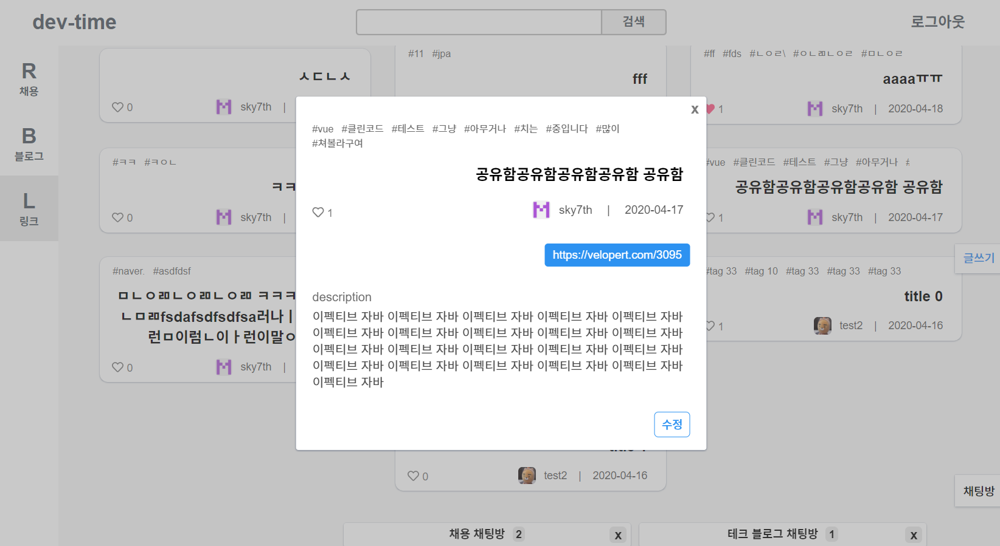
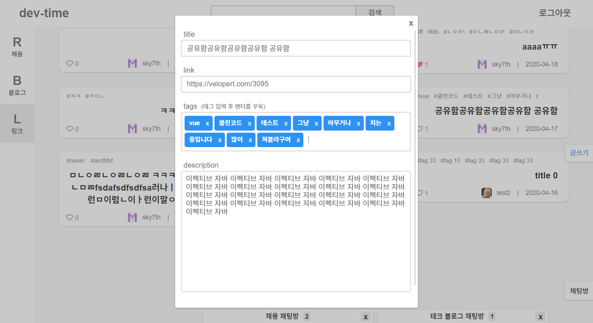
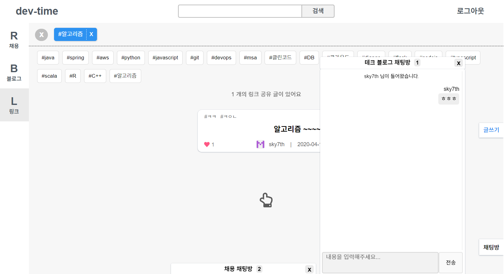

## dev-timeline  &#128187; &#128064;

유명 sw 기업들에서 운영하는 테크 블로그들에서는 많은 도움이 되는 양질의 글들을 접할 수 있습니다.

이 양질의 글들을 하나의 플랫폼에서 볼 수 있으면 좋을 것 같다는 생각이 들어 dev-timeline 을 만들게 되었습니다.

>채용 정보 목록이나 블로그 포스트 목록에서 아이템을 클릭하면 **해당 링크로 이동**합니다.

**제공하고자 하는 서비스**는 다음과 같습니다.
- 유명 sw 기업들의 **테크 블로그 포스트 모아보기**
- 유명 sw 기업들의 **채용 정보 모아보기**
- 개발 관련된 좋은 글의 **링크를 사용자들이 서로 공유**
- 위의 서비스들을 한 곳에서 모두 볼 수 있는 타임라인
- 서비스 카테고리 별 **실시간 채팅**
  

## 개발스택
### back-end
- jdk 8
- gradle 6
- spring boot 2.2
- spring data jpa
- spring security
- spring batch
- redis

### front-end
- vue.js
- vuex

## 요구사항
### 회원가입 / 로그인
- [ ] 회원가입
  - [x] 일반 회원가입
  - [ ] 이메일 인증
- [ ] 로그인
  - [x] 일반 로그인
  - [ ] OAuth 2.0 간편 로그인
    - [x] github
    - [ ] google

### 타임라인
- [ ] 채용 정보, 테크 블로그 포스트, 링크 공유 글들을 최신 글 순으로 모아서 보여주기

### 채용 정보, 테크 블로그 포스트
- [x] 하루에 2번 크롤링해서 가져오기
- [x] 채용 정보
  - [x] 무한 스크롤
- [x] 테크 블로그 포스트
  - [x] 하단 숫자 버튼 페이징
- [x] 검색 조건
  - [x] 타이틀
  - [x] 선택한 기업
- [ ] 좋아요
  - [ ] 글 목록 화면에서 좋아요와 좋아요 취소 기능

### 실시간 채팅
- [x] 로그인 한 유저만 채팅 가능
- [x] 사이드 메뉴 카테고리 별 채팅방 생성
- [x] 사이드 메뉴 카테고리 별 채팅방 다중 입장
- [x] 하단에 접어서 최소화, 다시 누르면 펼치기
- [ ] 채팅
  - [x] 유저 입장 메시지
  - [ ] 유저 퇴장 메시지
  - [x] 채팅 메시지
- [ ] 과거 채팅 메시지 검색
- [ ] 최소화 상태에서 채팅 메시지 받으면 깜빡 깜빡하며 알려주기
- [x] 채팅방 인원 표시 

### 링크 공유
- [x] 글
  - [x] 모달창 띄우기
    - [x] 열때는 오른쪽에서 날라오고 닫을 때는 왼쪽으로 날라가도록 
  - [x] 생성
    - [x] 태그 추가
      - [x] 태그명 입력 후 엔터를 치면 한 개씩 추가
      - [x] 태그 추가 취소
    - [x] 로그인 한 유저만 생성 가능
  - [x] 수정, 삭제
    - [x] 작성자만 수정 가능
- [x] 태그
  - [x] 추천 태그 상단에 노출
    - [x] 클릭 시 바로 검색 가능
  - [ ] 사용자들이 많이 사용한 태그를 추천 태그에 추가
- [x] 검색
  - [x] 타이틀
  - [ ] 설명
  - [ ] 태그
- [x] 정렬
  - [x] 최신 글 우선
  - [ ] 좋아요가 많은 글 우선
- [x] 좋아요
  - [x] 글 목록 화면에서 좋아요와 좋아요 취소 기능
  - [x] 글 상세보기 모달 창에서 좋아요와 좋아요 취소 기능
- [ ] 댓글
  - [ ] 생성
  - [ ] 수정, 삭제
    - [ ] 작성자만 가능
  - [ ] 대댓글
    - [ ] 최대 5개까지 노출, 그 이상일 경우 5개씩 더보기 버튼 추가
  - [ ] 좋아요
    - [ ] 좋아요와 좋아요 취소 기능
  - [ ] 좋아요가 많은 댓글 3개 상위 노출

### 마이페이지
- [ ] 내가 좋아요 한 글들 보기
  - [ ] 사이드 메뉴 카테고리별 보기
  - [ ] 검색
    - [ ] 타이틀
    - [ ] 설명
    - [ ] 태그
  - [ ] 정렬
    - [ ] 최신 글 우선
    - [ ] 좋아요가 많은 글 우선

### 모바일 뷰
- [ ] 사이드 메뉴를 롤링 메뉴로 변경

## 배운 것 (정리 중)
### jpa

### spring batch

### spring security

### redis pub/sub

### 크롤링

<!-- ## 화면 뷰
</img>
</img>
</img>
</img>
</img>
</img>
</img>
</img>
</img> -->