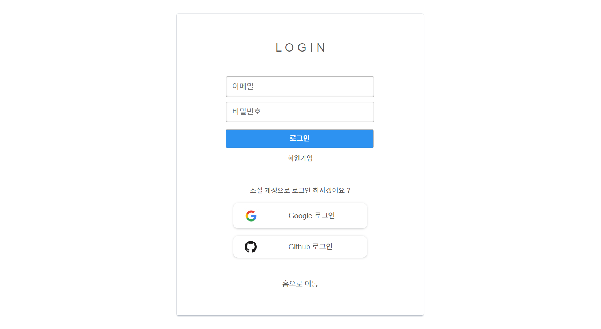

# dev-timeline  &#128187; &#128064; 
[사이트로 이동](https://devtimeline.com/)

유명 sw 기업들에서 운영하는 테크 블로그들에서는 많은 도움이 되는 양질의 글들을 접할 수 있습니다.

이 양질의 글들을 하나의 플랫폼에서 볼 수 있으면 좋을 것 같다는 생각이 들어 dev-timeline 을 만들게 되었습니다.

>채용 정보 목록이나 블로그 포스트 목록에서 아이템을 클릭하면 **해당 링크로 이동**합니다.

**제공하고자 하는 서비스**는 다음과 같습니다.
- 유명 sw 기업들의 **테크 블로그 포스트 모아보기**
- 유명 sw 기업들의 **채용 정보 모아보기**
- 개발 관련된 좋은 글의 **링크를 사용자들이 서로 공유**
- 위의 서비스들을 한 곳에서 모두 볼 수 있는 타임라인
- 서비스 카테고리 별 **실시간 채팅**
  
## [Wiki](https://github.com/sky7th/dev-timeline/wiki)
각 도메인마다 요구사항과 API 문서, 그리고 개발하며 고민한 내용들을 적어 놓았습니다.

## 개발스택
### back-end
- jdk 8
- gradle 6
- spring boot 2.2
- spring data jpa
- spring security
- spring batch
- redis

### front-end
- vue.js
- vuex

## Environment
- Java: JDK 8
- Spring Boot: 2.2.5.RELEASE
- MySQL: 8.0.17
- Gradle

## 프로젝트 목표
- 올바른 도메인 설계
    - 약한 의존성, 강한 응집도
- 아래의 프로그래밍 요구사항을 지키며 코드 작성
- 나쁜 냄새가 나는 코드에 대한 리팩토링
- 성능 최적화
    - 캐싱 전략
    - 인덱스와 쿼리 튜닝
    - DB 호출을 최소화
    - 비동기 프로그래밍을 활용

## 프로그래밍 요구사항
- 객체지향 5원칙을 지키면서 프로그래밍한다.
- 객체지향 생활 체조 원칙을 지키면서 프로그래밍한다.
- 사용자가 입력한 값에 대한 모든 예외 처리를 한다.
- 모든 로직에 단위 테스트를 구현한다.
- 객체지향 생활 체조 원칙
    - 규칙 1: 한 메서드에 오직 한 단계의 들여쓰기만 한다.
    - 규칙 2: else 예약어를 쓰지 않는다.
    - 규칙 3: 모든 원시값과 문자열을 포장한다.
    - 규칙 4: 한 줄에 점을 하나만 찍는다.
    - 규칙 5: 줄여쓰지 않는다(축약 금지).
    - 규칙 6: 모든 엔티티를 작게 유지한다.
    - 규칙 7: 3개 이상의 인스턴스 변수를 가진 클래스를 쓰지 않는다.
    - 규칙 8: 일급 콜렉션을 쓴다.
    - 규칙 9: 게터/세터/프로퍼티를 쓰지 않는다.

## 브랜치 전략
- [우아한 형제들 기술 블로그: 우린 Git-flow를 사용하고 있어요](http://woowabros.github.io/experience/2017/10/30/baemin-mobile-git-branch-strategy.html)

<!-- ## 화면 뷰
</img>
</img>
</img>
</img>
</img>
</img>
</img>
</img>
</img> -->
